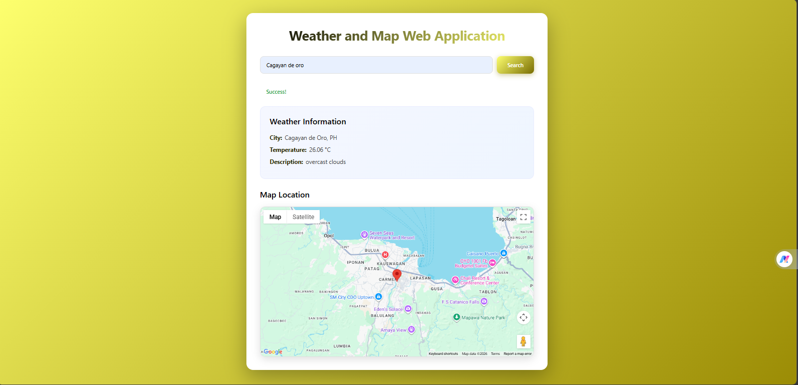

Weather and Map Web Application

Project Description

This web application allows users to search for any city and view its real-time weather information along with its geographic location displayed on Google Maps. The system integrates external APIs to fetch accurate weather data and map coordinates, providing an interactive and user-friendly experience.

---

 Features

Search weather by city name
Displays real-time temperature (°C)
Shows weather description
Displays city location on Google Maps
Dynamic map marker update
Error handling for invalid inputs and network issues
Supports multiple searches

---

Screenshot of Output

---

🔗 API Used

* OpenWeather API – for weather data
* Google Maps JavaScript API – for map display

👩‍💻 Author

Rhaiza Nicole Renigen

BSIT Student
Davao Central College